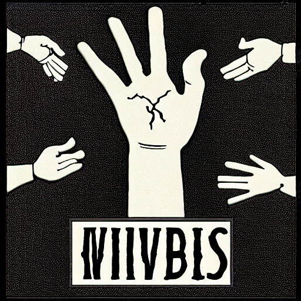
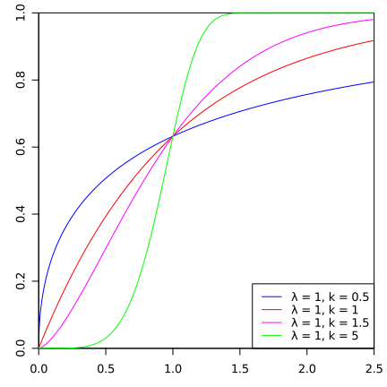

# TINIH • [](https://github.com/abigger87/femplate/actions/workflows/ci.yml)  

There Is No Invisible Hand.

## Why ?

In any [video-]game the developer is a, sometimes, merciful god for he is able to create an abundance of items [fungible or not] that could bring havoc to games that have a strong player-economy [WoW, CS, ...]. It is even more true in games [onchain or not] based on blockchain, involving ERC20s and ERC721s.

Such games, in particular on-chain, need tools to be more transparent towards its users.

## What ?

TINIH is a controller that computes the probability of, in a gaming context, an item to spawn. The probability is based on two quantities ; a target and a value. Such quantities can be either prices or supplies (for consumables for instance).

## How ?

The function used is the CDF of the [Weibull distribution](https://en.wikipedia.org/wiki/Weibull_distribution). With the right parameters, it has the shape of a nice sigmoid function which is close to what we intuitively desire ; high probability if the actual price is too high w.r.t the ratio (makes it more abundant) or low probability if it's too low (makes it more scarce).

<style>
    img {
        background-color: #FFFFFF;
    }
</style>
<p align="center">

</p>

## Blueprint

```ml
lib
├─ forge-std — https://github.com/foundry-rs/forge-std
├─ solmate — https://github.com/Rari-Capital/solmate
src
├─ TINIH — Probability controller
test
└─ TINIH.t — tests
```

## License

[AGPL-3.0-only](https://github.com/abigger87/femplate/blob/master/LICENSE)


## Acknowledgements

- [femplate](https://github.com/abigger87/femplate)
- [foundry](https://github.com/foundry-rs/foundry)
- [solmate](https://github.com/Rari-Capital/solmate)
- [forge-std](https://github.com/brockelmore/forge-std)
- [forge-template](https://github.com/foundry-rs/forge-template)
- [foundry-toolchain](https://github.com/foundry-rs/foundry-toolchain)


## Disclaimer

_These smart contracts are being provided as is. No guarantee, representation or warranty is being made, express or implied, as to the safety or correctness of the user interface or the smart contracts. They have not been audited and as such there can be no assurance they will work as intended, and users may experience delays, failures, errors, omissions, loss of transmitted information or loss of funds. The creators are not liable for any of the foregoing. Users should proceed with caution and use at their own risk._
